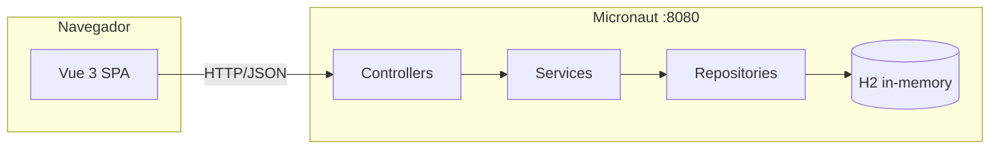

# Sistema de Moeda Estudantil

> Sistema acadêmico para **cadastro de alunos**, **cadastro de empresas parceiras** e base inicial de um programa de mérito estudantil com **moeda virtual**, com API REST em **Micronaut** e interface web em **Vue 3**. O back-end persiste dados em **H2 (em memória)** no ambiente padrão do repositório.

<table>
  <tr>
    <td width="800px">
      <div align="justify">
        Este repositório reúne o <b>front-end</b> (<code>frontend/sisttema-moeda-estudantil</code>) e o <b>back-end</b> (<code>backend/sistema-moeda-estudantil</code>). O front-end consome a API REST do Micronaut em <code>http://localhost:8080</code>; por padrão, a URL é definida em <code>src/api/client.ts</code> e pode ser sobrescrita pela variável <code>VITE_API_URL</code>.
      </div>
    </td>
    <td>
      <div>
        
      </div>
    </td>
  </tr>
</table>

---

## Status do Projeto


---

## Índice

- [Links úteis](#links-úteis)
- [Sobre o projeto](#sobre-o-projeto)
- [Funcionalidades principais](#funcionalidades-principais)
- [Tecnologias utilizadas](#tecnologias-utilizadas)
- [Arquitetura](#arquitetura)
- [Instalação e execução](#instalação-e-execução)
- [Estrutura de pastas](#estrutura-de-pastas)
- [API REST (referência rápida)](#api-rest-referência-rápida)
- [Documentação de modelagem](#documentação-de-modelagem)
- [Testes](#testes)
- [Documentação consultada](#documentação-consultada)
- [Autores](#autores)
- [Licença](#licença)
- [Agradecimentos](#agradecimentos)

---

## Links úteis

| Recurso | Observação |
|--------|------------|
| [Micronaut Guide](https://guides.micronaut.io/) | Guias oficiais do framework |
| [Micronaut Data](https://micronaut-projects.github.io/micronaut-data/latest/guide/) | Persistência com repositories e JPA |
| [Vue.js](https://vuejs.org/) | Documentação do Vue 3 |
| [Vite](https://vite.dev/) | Configuração e modo dev |
| [Mermaid](https://mermaid.js.org/) | Diagramas em Markdown usados na documentação |

*Não há deploy ou demo online configurados neste repositório; ajuste os links acima se publicar a aplicação.*

---

## Sobre o projeto

O **Sistema de Moeda Estudantil** é um trabalho acadêmico que simula uma plataforma de reconhecimento de mérito. Professores recebem moedas virtuais a cada semestre e podem distribuí-las a alunos como forma de reconhecimento por participação, bom desempenho ou comportamento positivo. Os alunos, por sua vez, podem acumular moedas e trocá-las futuramente por vantagens oferecidas por empresas parceiras.

**Problema abordado:** organizar o cadastro de alunos, professores, instituições de ensino e empresas parceiras, criando a base para um sistema de mérito estudantil com saldo, transações, vantagens e resgates.

**Contexto:** projeto de laboratório / disciplina, com foco em modelagem, camadas de back-end (controller, service, repository), persistência com ORM e SPA consumindo REST.

---

## Funcionalidades principais

- **Alunos:** listar, criar, buscar por id, atualizar e remover alunos vinculados a instituições participantes.
- **Empresas parceiras:** listar, criar, buscar por id, atualizar e remover empresas que poderão oferecer vantagens aos alunos.
- **Instituições:** listagem de instituições pré-cadastradas para associação no cadastro de alunos.
- **Dados iniciais:** carga automática de instituições, professores, alunos e empresas parceiras para facilitar demonstração.
- **Interface web:** páginas **Início**, **Alunos** e **Empresas Parceiras** (Vue Router), formulários, listagens e feedback de operações.
- **Modelagem:** documentação com casos de uso, histórias de usuário, diagrama de classes, diagrama de componentes e modelo ER.

---

## Tecnologias utilizadas

### Front-end (`frontend/sisttema-moeda-estudantil`)

- **Vue 3** com **Composition API** e **TypeScript**
- **Vue Router 4**
- **Axios** para chamadas HTTP
- **Vite 8** (dev server na porta **5173**)
- Estilos em **CSS** (`src/style.css`)

### Back-end (`backend/sistema-moeda-estudantil`)

- **Java 8**
- **Micronaut 3.10.4** (runtime Netty, validação HTTP, Micronaut Serialization / Jackson)
- **Micronaut Data JPA** com **Hibernate** e **HikariCP**
- **H2** em memória (configuração padrão em `application.properties`)
- **Gradle 7.6.4** (wrapper incluso: `./gradlew`)
- **JUnit 5** para testes

---

## Arquitetura

- **Back-end:** estilo em camadas — **controllers** REST (`@Controller`), **services** com regras de negócio, **repositories** (Micronaut Data), entidades JPA em `domain`, DTOs de entrada/saída em `dto`, tratamento global em `exception` e carga inicial em `seed`.
- **Front-end:** SPA com **rotas** por view; chamadas HTTP centralizadas em `src/api/`; tipos compartilhados em `src/types`; telas em `src/views`.
- **Integração local:** o front-end usa `axios` para chamar a API em `http://localhost:8080` por padrão. A URL pode ser alterada com `VITE_API_URL`.



---

## Instalação e execução

### Pré-requisitos

- **JDK 8**
- **Node.js** 18+ (recomendado LTS) e **npm**

### 1. Clonar e entrar na raiz do repositório

```bash
git clone <url-do-repositorio>
cd sistema-moeda-estudantil
```

### 2. Back-end (Micronaut)

Na pasta `backend/sistema-moeda-estudantil`:

```bash
cd backend/sistema-moeda-estudantil
./gradlew run
```

A API sobe por padrão em **http://localhost:8080**.

### 3. Front-end (Vue + Vite)

Em outro terminal, na pasta do projeto Vue:

```bash
cd frontend/sisttema-moeda-estudantil
npm install
npm run dev
```

Abra **http://localhost:5173**.

### URL da API no front-end

Por padrão, o front-end usa **http://localhost:8080**. Para apontar para outro endereço:

```bash
VITE_API_URL=http://outro-host:8080 npm run dev
```

### Build de produção

**Front-end:**

```bash
cd frontend/sisttema-moeda-estudantil
npm run build
```

Saída em `frontend/sisttema-moeda-estudantil/dist`. Em produção, sirva o SPA e configure a URL da API via `VITE_API_URL` no momento do build ou ajuste a infraestrutura para expor a API no endereço esperado.

**Back-end (JAR):**

```bash
cd backend/sistema-moeda-estudantil
./gradlew shadowJar
```

O artefato gerado pelo plugin Shadow fica em `backend/sistema-moeda-estudantil/build/libs/` (nome conforme versão do projeto).

### Banco de dados

O perfil padrão usa **H2 em memória** (`jdbc:h2:mem:moedaestudantil`) com geração automática de schema pelo Hibernate (`hibernate.hbm2ddl.auto=update`). **Não é obrigatório** Docker ou PostgreSQL para rodar o estado atual do repositório.

Ao iniciar, o `DataSeeder` insere dados de demonstração:

- 3 instituições: PUC Minas, UFMG e CEFET-MG
- 3 professores
- 5 alunos
- 4 empresas parceiras

---

## Estrutura de pastas

```
.
├── README.md
├── docs/                                  # Modelagem do sistema
│   ├── 01-casos-de-uso.md
│   ├── 02-historias-de-usuario.md
│   ├── 03-diagrama-de-classes.md
│   ├── 04-diagrama-de-componentes.md
│   └── 05-modelo-er.md
│
├── backend/
│   └── sistema-moeda-estudantil/          # Back-end Micronaut (API REST)
│       ├── build.gradle
│       ├── gradle.properties
│       ├── settings.gradle
│       ├── gradlew
│       └── src/main/java/com/sistemamoedaestudantil/
│           ├── Application.java
│           ├── controller/                # REST: Aluno, Empresa Parceira e Instituição
│           ├── service/
│           ├── repository/
│           ├── domain/                    # Entidades JPA e enum TipoTransacao
│           ├── dto/                       # DTOs de entrada e resposta
│           ├── exception/
│           └── seed/                      # DataSeeder com dados mockados
│       └── src/main/resources/
│           ├── application.properties
│           └── logback.xml
│
└── frontend/
    └── sisttema-moeda-estudantil/         # Front-end Vue 3 + Vite
        ├── package.json
        ├── vite.config.ts
        ├── index.html
        └── src/
            ├── main.ts
            ├── App.vue
            ├── api/                       # Cliente HTTP e módulos por recurso
            ├── router/index.ts
            ├── types/index.ts
            ├── views/                     # HomeView, alunos e empresas
            └── style.css
```

---

## API REST (referência rápida)

Base no Micronaut: **http://localhost:8080**

| Método | Caminho | Descrição |
|--------|---------|-----------|
| `GET` | `/api/alunos` | Lista alunos |
| `POST` | `/api/alunos` | Cria aluno |
| `GET` | `/api/alunos/{id}` | Busca aluno por id |
| `PUT` | `/api/alunos/{id}` | Atualiza aluno |
| `DELETE` | `/api/alunos/{id}` | Remove aluno |
| `GET` | `/api/empresas` | Lista empresas parceiras |
| `POST` | `/api/empresas` | Cria empresa parceira |
| `GET` | `/api/empresas/{id}` | Busca empresa por id |
| `PUT` | `/api/empresas/{id}` | Atualiza empresa |
| `DELETE` | `/api/empresas/{id}` | Remove empresa |
| `GET` | `/api/instituicoes` | Lista instituições |
| `GET` | `/api/instituicoes/{id}` | Busca instituição por id |

**Exemplo (listar alunos):**

```bash
curl -s http://localhost:8080/api/alunos
```

**Exemplo (listar empresas parceiras):**

```bash
curl -s http://localhost:8080/api/empresas
```

---

## Documentação de modelagem

| Artefato | Arquivo |
|----------|---------|
| Diagrama de Casos de Uso | [`docs/01-casos-de-uso.md`](./docs/01-casos-de-uso.md) |
| Histórias do Usuário | [`docs/02-historias-de-usuario.md`](./docs/02-historias-de-usuario.md) |
| Diagrama de Classes | [`docs/03-diagrama-de-classes.md`](./docs/03-diagrama-de-classes.md) |
| Diagrama de Componentes | [`docs/04-diagrama-de-componentes.md`](./docs/04-diagrama-de-componentes.md) |
| Modelo ER + estratégia de acesso a dados | [`docs/05-modelo-er.md`](./docs/05-modelo-er.md) |

Os diagramas usam [Mermaid](https://mermaid.js.org/), renderizado nativamente no GitHub e em editores Markdown modernos.

---

## Testes

**Back-end:**

```bash
cd backend/sistema-moeda-estudantil
./gradlew test
```

**Front-end:**

```bash
cd frontend/sisttema-moeda-estudantil
npm run build
```

O front-end ainda não define script `test` no `package.json`; testes unitários ou E2E podem ser adicionados conforme a disciplina exigir.

---

## Documentação consultada

- [Micronaut Documentation](https://docs.micronaut.io/)
- [Micronaut Data](https://micronaut-projects.github.io/micronaut-data/latest/guide/)
- [Micronaut SQL / Hibernate](https://micronaut-projects.github.io/micronaut-sql/latest/guide/)
- [Vue 3](https://vuejs.org/guide/introduction.html)
- [Vue Router](https://router.vuejs.org/)
- [Vite](https://vite.dev/config/)
- [Axios](https://axios-http.com/)

---

## Autores

Projeto desenvolvido pelos alunos:

| Nome |
|------|
| **Ana Flávia** |
| **Miguel Martins** |

---

## Licença

Defina a licença do trabalho acadêmico conforme orientação da disciplina.

---

## Agradecimentos

- [**Engenharia de Software PUC Minas**](https://www.instagram.com/engsoftwarepucminas/)
- [**Prof. Dr. João Paulo Aramuni**](https://github.com/joaopauloaramuni) — referência de documentação e boas práticas em README (template acadêmico).
