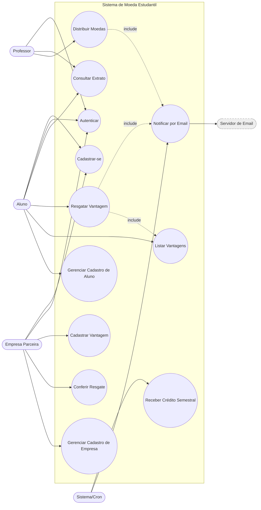

# Diagrama de Casos de Uso

Sistema de Moeda Estudantil — Release 1.

## Descrição resumida dos casos de uso

| ID | Caso de Uso | Ator(es) | Descrição |
|----|-------------|----------|-----------|
| UC1 | Cadastrar-se | Aluno, Empresa | Aluno informa nome, e-mail, CPF, RG, endereço, instituição e curso. Empresa informa razão social, CNPJ, endereço e contato. |
| UC2 | Autenticar | Aluno, Professor, Empresa | Login via e-mail/CPF e senha. |
| UC3 | Consultar Extrato | Aluno, Professor | Visualiza saldo atual e histórico de transações. |
| UC4 | Distribuir Moedas | Professor | Envia moedas a um aluno informando motivo (mensagem obrigatória). |
| UC5 | Resgatar Vantagem | Aluno | Seleciona vantagem, tem valor descontado e recebe cupom por e-mail. |
| UC6 | Cadastrar Vantagem | Empresa | Cadastra descrição, foto e custo (em moedas) da vantagem. |
| UC7 | Conferir Resgate | Empresa | Confere o código do cupom enviado por e-mail. |
| UC8 | Notificar por Email | Sistema | Envia e-mails (recebimento de moedas, cupom, conferência). |
| UC9 | Receber Crédito Semestral | Sistema | Adiciona 1.000 moedas ao saldo de cada professor a cada semestre. |
| UC10 | Listar Vantagens | Aluno | Visualiza vantagens cadastradas pelas empresas parceiras. |
| UC11 | Gerenciar Cadastro de Aluno | Aluno (admin) | CRUD de aluno (foco da Release 1). |
| UC12 | Gerenciar Cadastro de Empresa | Empresa (admin) | CRUD de empresa parceira (foco da Release 1). |
