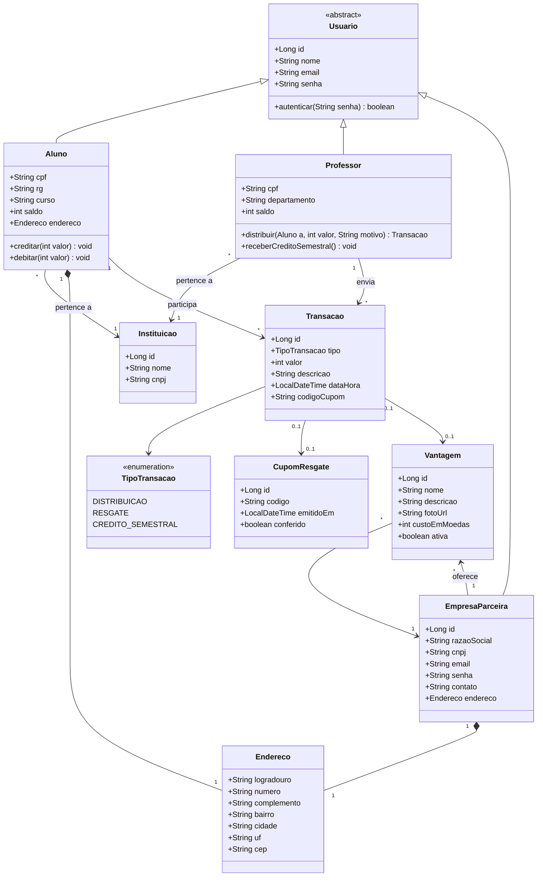

# Diagrama de Classes

Visão de domínio do Sistema de Moeda Estudantil.

## Notas de modelagem

- `Usuario` é uma superclasse abstrata que generaliza atributos comuns (login/senha). Em JPA, será mapeada com `@MappedSuperclass`.
- `Aluno` e `Professor` mantêm um `saldo` em moedas (inteiro). Para o aluno o saldo é incrementado por `Transacao` do tipo DISTRIBUICAO e decrementado por RESGATE; para o professor, é incrementado por CREDITO_SEMESTRAL e decrementado por DISTRIBUICAO.
- `Endereco` é um Value Object embutível (`@Embeddable`).
- `Transacao` é a entidade central do extrato; serve tanto para distribuição (Professor → Aluno) quanto para resgate (Aluno → Vantagem da Empresa).
- `CupomResgate` poderia ser substituído por um `codigoCupom` simples na própria Transação; foi mantido como classe para evidenciar a regra "código gerado pelo sistema" em UC5.
