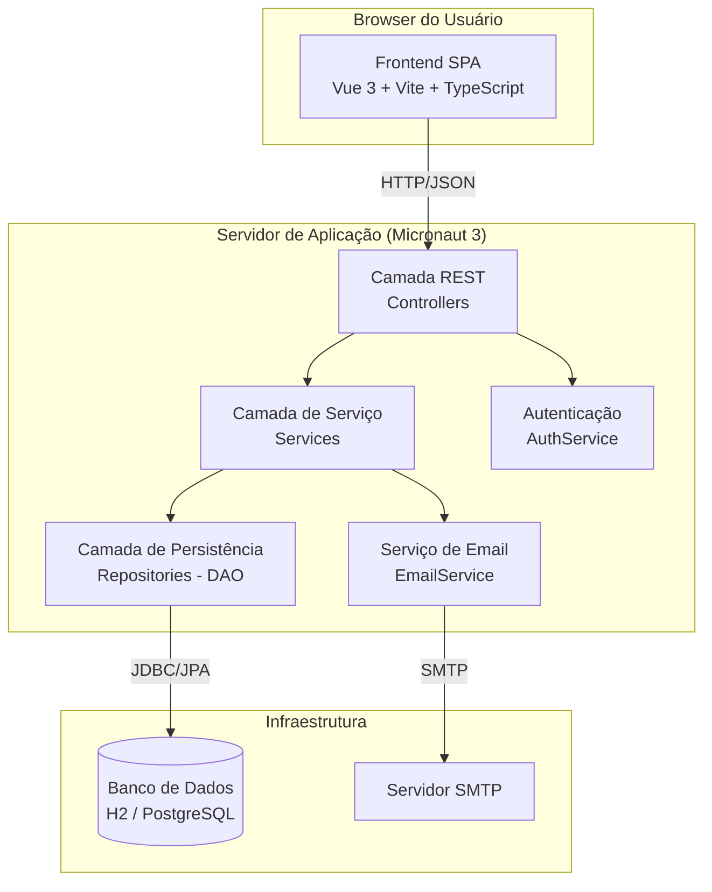

# Diagrama de Componentes

Visão de alto nível dos componentes do sistema.

## Decomposição

### Frontend (Vue 3 + Vite)
- `views/` — páginas (Home, CRUD Aluno, CRUD Empresa, etc.)
- `components/` — componentes reutilizáveis
- `api/` — clientes HTTP (axios) por recurso
- `router/` — roteamento SPA
- `stores/` — estado global (pinia)

### Backend (Micronaut 3)
- `controller/` — endpoints REST (`/api/alunos`, `/api/empresas`, ...)
- `service/` — regras de negócio (transferência atômica de moedas, geração de cupom)
- `repository/` — Micronaut Data JPA (Padrão DAO/Repository)
- `domain/` — entidades JPA do modelo
- `dto/` — objetos de transporte de entrada e saída
- `exception/` — handlers globais de erro

### Infraestrutura
- **Banco**: H2 em desenvolvimento (in-memory) e PostgreSQL em produção (configurável via `application.properties`).
- **SMTP**: integração futura para notificações de moedas e cupons.

## Comunicação

| De | Para | Protocolo | Formato |
|----|------|-----------|---------|
| Frontend | Backend | HTTP/REST | JSON |
| Backend | Banco | JDBC | SQL |
| Backend | SMTP | SMTP | MIME |
