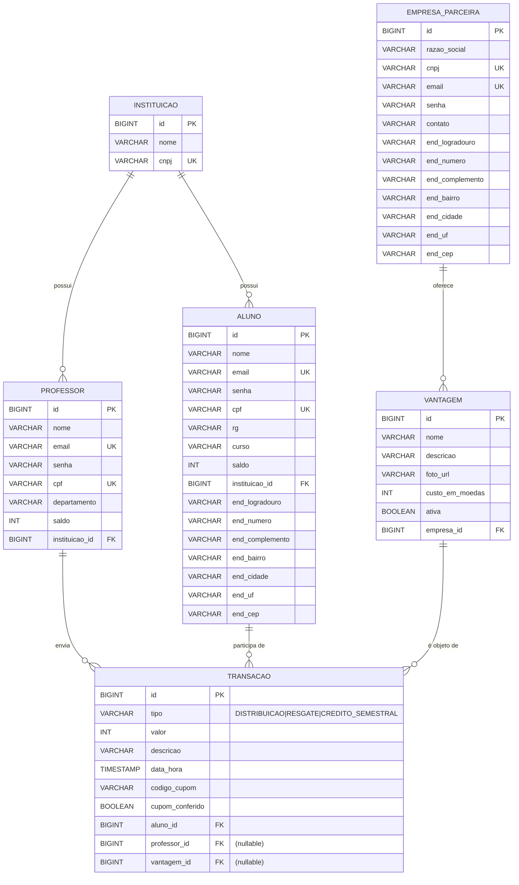

# Modelo Entidade-Relacionamento

## Regras de integridade

- `INSTITUICAO.cnpj`, `ALUNO.cpf`, `ALUNO.email`, `PROFESSOR.cpf`, `PROFESSOR.email`, `EMPRESA_PARCEIRA.cnpj`, `EMPRESA_PARCEIRA.email` são UNIQUE.
- `ALUNO.saldo` e `PROFESSOR.saldo` têm valor padrão `0`.
- Em `TRANSACAO`, `professor_id` e `vantagem_id` são nuláveis (transação só usa um deles, conforme o `tipo`).
- O `codigo_cupom` é gerado para `tipo = RESGATE`.

## Estratégia de acesso a dados

- **ORM**: JPA / Hibernate
- **Padrão**: Repository (DAO) via Micronaut Data
  - `interface AlunoRepository extends CrudRepository<Aluno, Long>` — Micronaut gera implementação em tempo de compilação.
  - Métodos custom (e.g., `findByCpf`, `findByEmail`) são derivados do nome.
- **Datasource em desenvolvimento**: H2 in-memory (`jdbc:h2:mem:moedaestudantil`) com `data.sql` para seed.
- **Datasource em produção**: PostgreSQL (configurável via variável de ambiente).
- **Transações**: anotação `@Transactional` (Jakarta Transactions API) nos services para garantir atomicidade nas operações de moeda.
