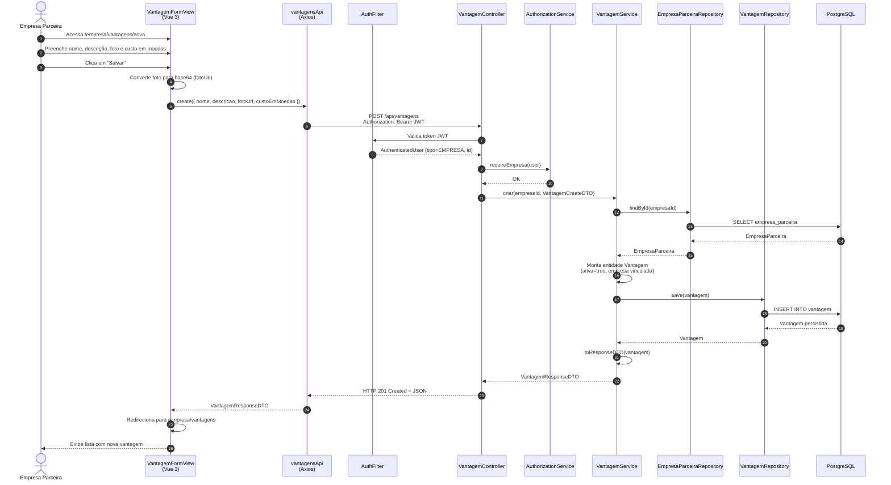

# Diagrama de Sequência — Cadastro de Vantagem (HU-06)

**Caso de uso:** Como empresa parceira, cadastrar vantagens com descrição, foto e custo em moedas.

**Atores:** Empresa Parceira  
**Release:** 2 — Lab04S02

---

## Diagrama de Sequência

---

## Descrição do fluxo

| Passo | Descrição |
|-------|-----------|
| 1–3 | A empresa autenticada acessa o formulário e informa os dados da vantagem. |
| 4–5 | A foto é enviada como URL/base64 no campo `fotoUrl` do JSON. |
| 6–9 | O backend valida o JWT e verifica se o usuário tem perfil `EMPRESA`. |
| 10–13 | O serviço carrega a empresa logada e cria a vantagem com `ativa = true`. |
| 14–18 | A vantagem é persistida e retornada como `VantagemResponseDTO`. |
| 19–21 | O frontend redireciona para a listagem de vantagens da empresa. |

---

## Mapeamento com o código (implementação)

| Camada | Artefato |
|--------|----------|
| Frontend — view | `frontend/sisttema-moeda-estudantil/src/views/empresa/VantagemFormView.vue` |
| Frontend — rota | `/empresa/vantagens/nova` (`empresa-vantagem-nova`) |
| Frontend — API | `frontend/sisttema-moeda-estudantil/src/api/vantagens.ts` → `create()` |
| Backend — controller | `VantagemController.criar()` → `POST /api/vantagens` |
| Backend — autorização | `AuthorizationService.requireEmpresa()` |
| Backend — serviço | `VantagemService.criar()` |
| Backend — persistência | `EmpresaParceiraRepository`, `VantagemRepository` |
| Backend — DTO entrada | `VantagemCreateDTO` (nome, descrição, fotoUrl, custoEmMoedas) |
| Backend — DTO saída | `VantagemResponseDTO` |
| Banco | Tabela `vantagem` (FK `empresa_id`) |

---

## Critérios de aceite atendidos

- CA implícito: empresa autenticada cadastra vantagem com descrição, foto e custo em moedas.
- A vantagem fica disponível para listagem pelos alunos (`ativa = true`).
