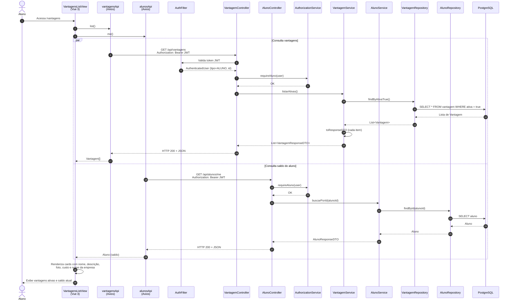

# Diagrama de Sequência — Listagem de Vantagens (HU-07)

**Caso de uso:** Como aluno, visualizar as vantagens disponíveis para decidir como gastar minhas moedas.

**Atores:** Aluno  
**Release:** 2 — Lab04S02

---

## Diagrama de Sequência

---

## Descrição do fluxo

| Passo | Descrição |
|-------|-----------|
| 1 | O aluno autenticado navega até a tela de vantagens. |
| 2–3 | A view dispara duas requisições em paralelo: listagem de vantagens e perfil do aluno (saldo). |
| 4–12 | O backend valida JWT, exige perfil `ALUNO` e retorna apenas vantagens com `ativa = true`. |
| 13–20 | Em paralelo, consulta o saldo do aluno logado via `/api/alunos/me`. |
| 21–22 | O frontend exibe cards com foto, descrição, custo em moedas e empresa parceira. |

---

## Mapeamento com o código (implementação)

| Camada | Artefato |
|--------|----------|
| Frontend — view | `frontend/sisttema-moeda-estudantil/src/views/aluno/VantagensListView.vue` |
| Frontend — rota | `/vantagens` (`aluno-vantagens`) |
| Frontend — API vantagens | `vantagensApi.list()` → `GET /api/vantagens` |
| Frontend — API aluno | `alunosApi.me()` → `GET /api/alunos/me` |
| Backend — controller | `VantagemController.listarAtivas()` |
| Backend — autorização | `AuthorizationService.requireAluno()` |
| Backend — serviço | `VantagemService.listarAtivas()` |
| Backend — persistência | `VantagemRepository.findByAtivaTrue()` |
| Backend — DTO saída | `VantagemResponseDTO` (id, nome, descricao, fotoUrl, custoEmMoedas, empresaNome) |
| Banco | Tabela `vantagem` + join com `empresa_parceira` |

---

## Critérios de aceite atendidos

- O aluno visualiza todas as vantagens **ativas** cadastradas pelas empresas parceiras.
- Cada vantagem exibe descrição, foto (quando informada) e custo em moedas.
- O saldo atual do aluno é exibido para apoiar a decisão de resgate.
