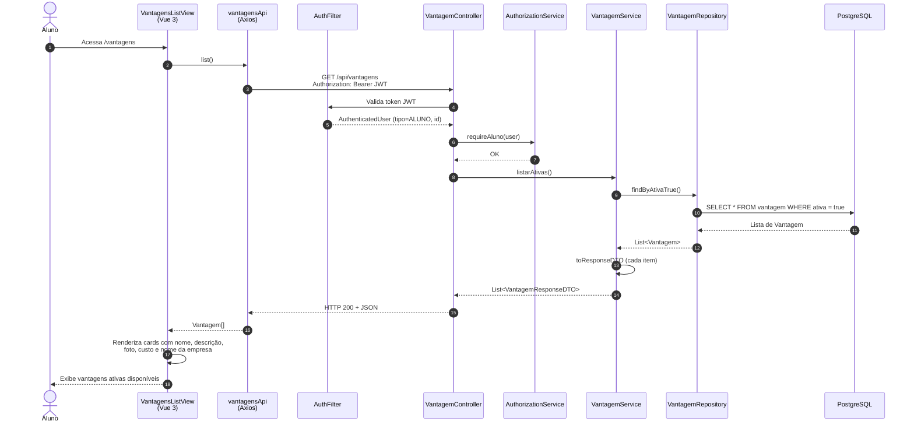

# Diagrama de Sequência — Listagem de Vantagens (HU-07)

**Caso de uso:** Como aluno, visualizar as vantagens disponíveis para decidir como gastar minhas moedas.

**Atores:** Aluno  
**Release:** 2 — Lab04S02

---

## Diagrama de Sequência

---

## Descrição do fluxo

| Passo | Descrição |
|-------|-----------|
| 1 | O aluno autenticado navega até a tela de vantagens. |
| 2–3 | A view solicita a listagem via `vantagensApi.list()`. |
| 4–7 | O backend valida JWT e exige perfil `ALUNO`. |
| 8–12 | O serviço consulta apenas vantagens com `ativa = true` e monta os DTOs de resposta. |
| 13–15 | O frontend exibe cards com foto, descrição, custo em moedas e empresa parceira. |

> **Nota:** a tela também exibe o saldo do aluno (`GET /api/alunos/me`), mas isso pertence a outro fluxo auxiliar e **não faz parte** deste diagrama de listagem.

---

## Mapeamento com o código (implementação)

| Camada | Artefato |
|--------|----------|
| Frontend — view | `frontend/sisttema-moeda-estudantil/src/views/aluno/VantagensListView.vue` |
| Frontend — rota | `/vantagens` (`aluno-vantagens`) |
| Frontend — API | `vantagensApi.list()` → `GET /api/vantagens` |
| Backend — controller | `VantagemController.listarAtivas()` |
| Backend — autorização | `AuthorizationService.requireAluno()` |
| Backend — serviço | `VantagemService.listarAtivas()` |
| Backend — persistência | `VantagemRepository.findByAtivaTrue()` |
| Backend — DTO saída | `VantagemResponseDTO` (id, nome, descricao, fotoUrl, custoEmMoedas, empresaNome) |
| Banco | Tabela `vantagem` + join com `empresa_parceira` |

---

## Critérios de aceite atendidos

- O aluno visualiza todas as vantagens **ativas** cadastradas pelas empresas parceiras.
- Cada vantagem exibe descrição, foto (quando informada) e custo em moedas.
- O aluno consegue visualizar o custo em moedas de cada vantagem para decidir o resgate.
