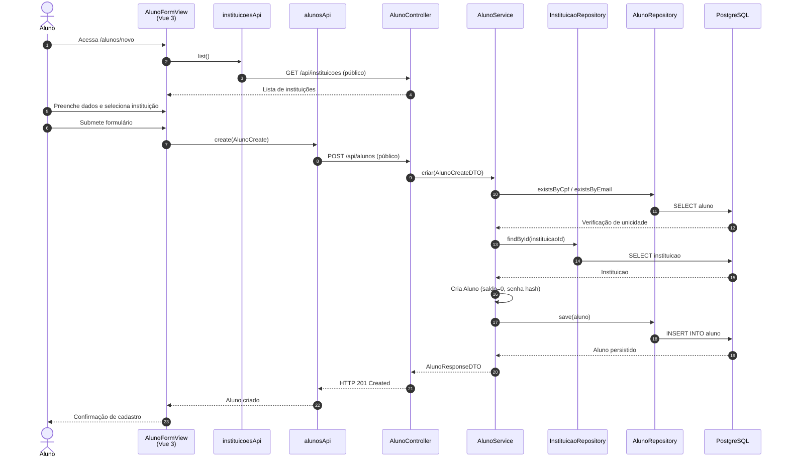

# Diagrama de Sequência — Cadastro de Aluno (HU-01)

**Caso de uso:** Como aluno, cadastrar meus dados para participar do programa de mérito.

**Atores:** Aluno (visitante)  
**Release:** 1

---

## Diagrama de Sequência

---

## Implementação

| Camada | Artefato |
|--------|----------|
| Frontend | `views/alunos/AlunoFormView.vue`, rota `/alunos/novo` |
| API | `alunosApi.create()` → `POST /api/alunos` |
| Backend | `AlunoController.criar()`, `AlunoService.criar()` |
