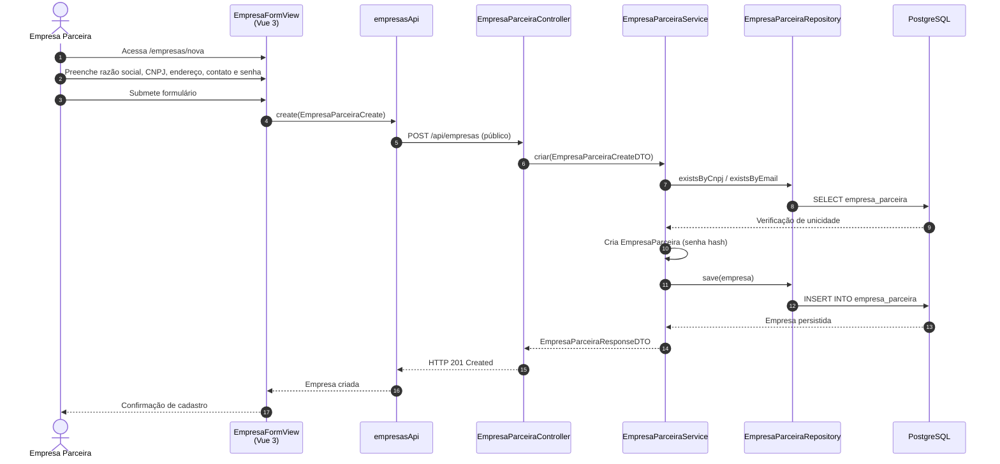

# Diagrama de Sequência — Cadastro de Empresa Parceira (HU-02)

**Caso de uso:** Como empresa parceira, cadastrar minha empresa no sistema.

**Atores:** Empresa Parceira (visitante)  
**Release:** 1

---

## Diagrama de Sequência

---

## Implementação

| Camada | Artefato |
|--------|----------|
| Frontend | `views/empresas/EmpresaFormView.vue`, rota `/empresas/nova` |
| API | `empresasApi.create()` → `POST /api/empresas` |
| Backend | `EmpresaParceiraController.criar()`, `EmpresaParceiraService.criar()` |
