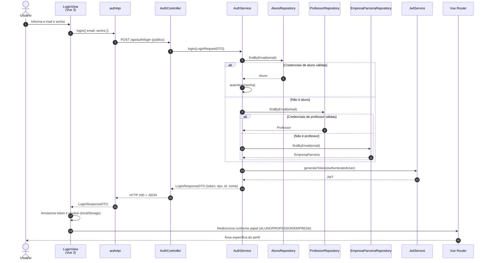

# Diagrama de Sequência — Login (HU-03)

**Caso de uso:** Como usuário, fazer login com e-mail e senha para acessar o sistema.

**Atores:** Aluno, Professor ou Empresa Parceira  
**Release:** 1

---

## Diagrama de Sequência

---

## Implementação

| Camada | Artefato |
|--------|----------|
| Frontend | `views/LoginView.vue`, `composables/useAuth.ts` |
| API | `authApi.login()` → `POST /api/auth/login` |
| Backend | `AuthController.login()`, `AuthService.login()` |
| Redirecionamento | `permissions/homeRouteForRole()` |
