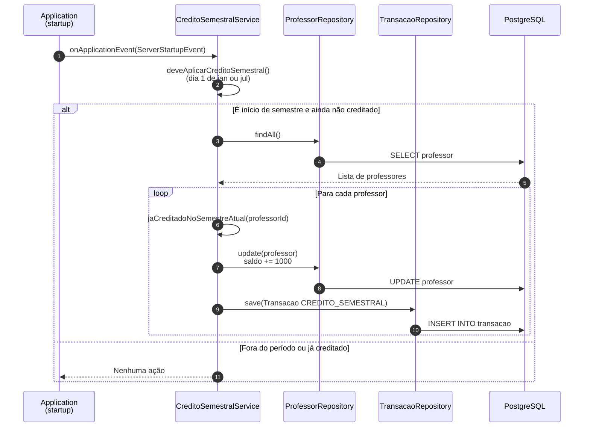

# Diagrama de Sequência — Crédito Semestral do Professor (HU-04)

**Caso de uso:** Como professor, receber automaticamente 1.000 moedas a cada novo semestre.

**Atores:** Sistema (automático)  
**Release:** 2

---

## Diagrama de Sequência

---

## Implementação

| Camada | Artefato |
|--------|----------|
| Backend | `CreditoSemestralService` (listener de startup) |
| Persistência | `ProfessorRepository`, `TransacaoRepository` |
| Regra | +1.000 moedas acumuláveis; tipo `CREDITO_SEMESTRAL` |
