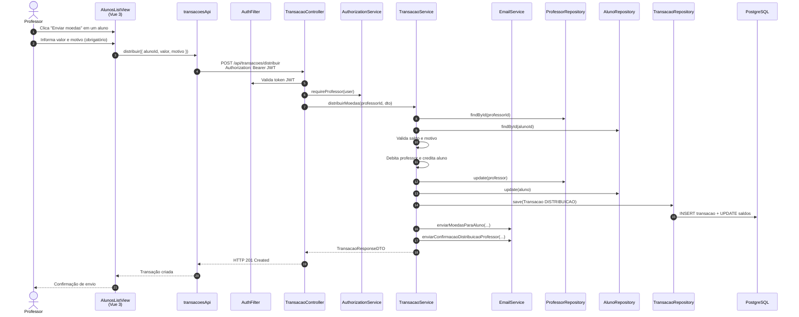

# Diagrama de Sequência — Distribuir Moedas (HU-05)

**Caso de uso:** Como professor, enviar moedas a um aluno informando um motivo.

**Atores:** Professor  
**Release:** 2

---

## Diagrama de Sequência

---

## Implementação

| Camada | Artefato |
|--------|----------|
| Frontend | `views/alunos/AlunosListView.vue` (modal de distribuição) |
| API | `transacoesApi.distribuir()` → `POST /api/transacoes/distribuir` |
| Backend | `TransacaoService.distribuirMoedas()`, `EmailService` |
