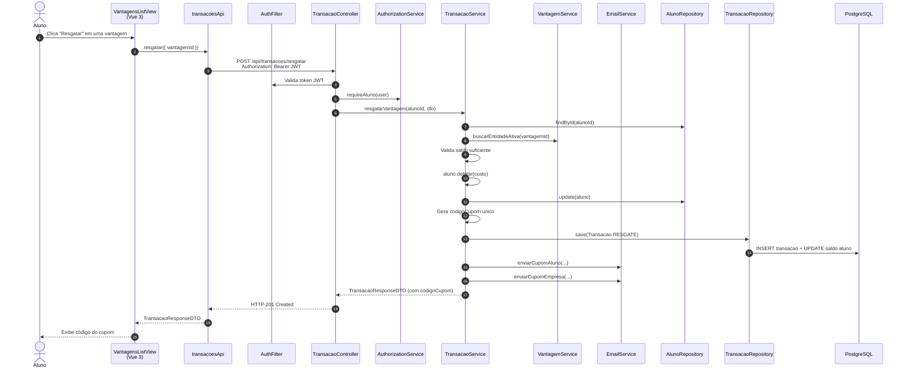

# Diagrama de Sequência — Resgatar Vantagem (HU-08)

**Caso de uso:** Como aluno, trocar moedas por uma vantagem cadastrada.

**Atores:** Aluno  
**Release:** 2

---

## Diagrama de Sequência

---

## Implementação

| Camada | Artefato |
|--------|----------|
| Frontend | `views/aluno/VantagensListView.vue` |
| API | `transacoesApi.resgatar()` → `POST /api/transacoes/resgatar` |
| Backend | `TransacaoService.resgatarVantagem()`, `EmailService` |
