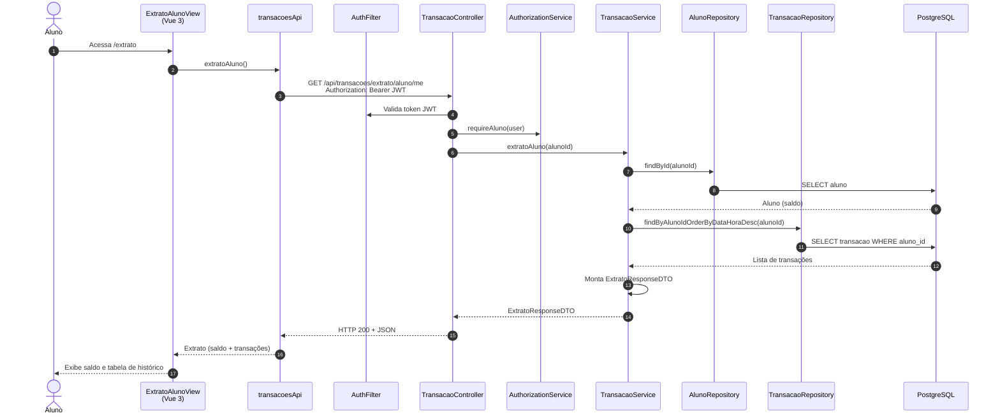

# Diagrama de Sequência — Extrato do Aluno (HU-09)

**Caso de uso:** Como aluno, consultar meu saldo e histórico de recebimentos e resgates.

**Atores:** Aluno  
**Release:** 2

---

## Diagrama de Sequência

---

## Implementação

| Camada | Artefato |
|--------|----------|
| Frontend | `views/aluno/ExtratoAlunoView.vue`, rota `/extrato` |
| API | `transacoesApi.extratoAluno()` → `GET /api/transacoes/extrato/aluno/me` |
| Backend | `TransacaoService.extratoAluno()` |
