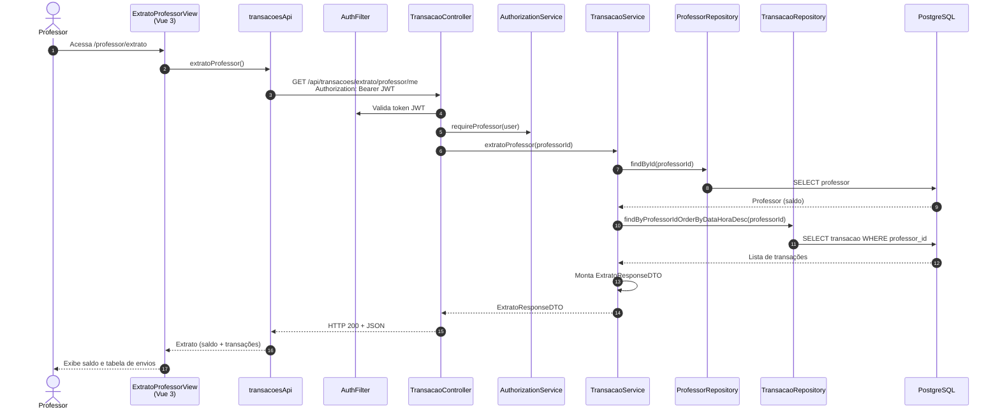

# Diagrama de Sequência — Extrato do Professor (HU-10)

**Caso de uso:** Como professor, consultar meu saldo e os envios de moedas realizados.

**Atores:** Professor  
**Release:** 2

---

## Diagrama de Sequência

---

## Implementação

| Camada | Artefato |
|--------|----------|
| Frontend | `views/professor/ExtratoProfessorView.vue`, rota `/professor/extrato` |
| API | `transacoesApi.extratoProfessor()` → `GET /api/transacoes/extrato/professor/me` |
| Backend | `TransacaoService.extratoProfessor()` |
