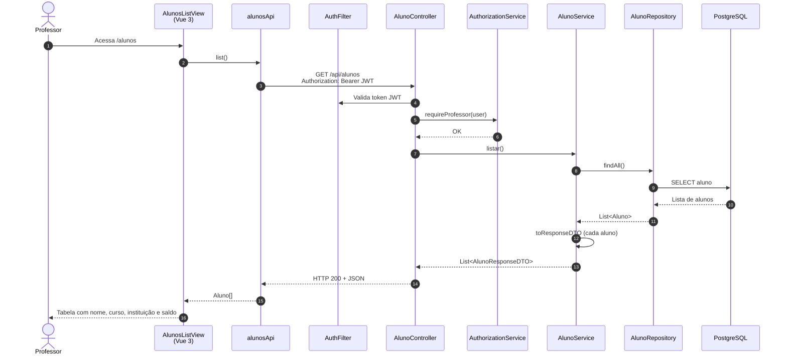

# Diagrama de Sequência — Gerenciar Cadastro de Aluno (HU-11)

**Caso de uso:** Como professor ou o próprio aluno, consultar e atualizar registros de alunos.

**Atores:** Professor (listagem) / Aluno (edição do próprio perfil)  
**Release:** 1

> Este diagrama representa a **consulta da lista de alunos pelo professor**. O cadastro inicial é HU-01; a edição do próprio perfil usa `PUT /api/alunos/{id}`.

---

## Diagrama de Sequência

---

## Implementação

| Camada | Artefato |
|--------|----------|
| Frontend — listagem | `views/alunos/AlunosListView.vue` |
| Frontend — edição | `views/alunos/AlunoFormView.vue` → `PUT /api/alunos/{id}` |
| API | `alunosApi.list()`, `alunosApi.update()` |
| Backend | `AlunoController`, `AlunoService`, `AuthorizationService` |
