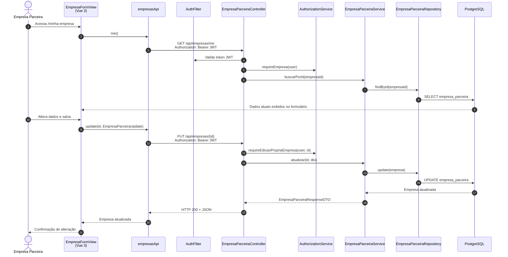

# Diagrama de Sequência — Gerenciar Cadastro de Empresa (HU-12)

**Caso de uso:** Como empresa parceira, consultar e atualizar os dados da própria empresa.

**Atores:** Empresa Parceira  
**Release:** 1

> Este diagrama representa a **edição do próprio cadastro**. O cadastro inicial é HU-02.

---

## Diagrama de Sequência

---

## Implementação

| Camada | Artefato |
|--------|----------|
| Frontend | `views/empresas/EmpresaFormView.vue`, rota `/minha-empresa` |
| API | `empresasApi.me()`, `empresasApi.update()` |
| Backend | `EmpresaParceiraController`, `EmpresaParceiraService` |
